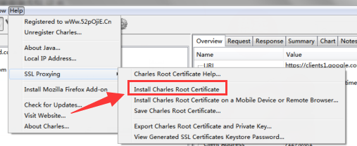
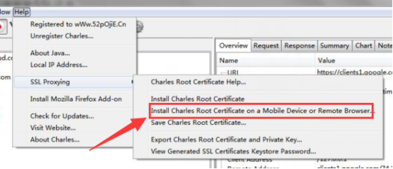

# Charles
参考文档： https://www.jianshu.com/p/fb2bdde5b498
> 是一款代理服务器，主要功能是：

 > ①：截取HTTP和HTTPS网络封包
 
 > ②：可以重发网络请求，方便后端调试
 
 > ③：可以修改网络请求参数
 
 > ④：可以截取网络请求并动态修改
 
 > ⑤：可以模拟慢速网络
 
 ## 一.安装使用
 Charles收费，但是没付费的用户也可使用，只不过就是过半小时需要重新启动一下。使用时需要关闭电脑防火墙。
 ### 1.链接手机和Charles
 ①：手机和安装Charles的电脑需要在同一个局域网中。
 
 ②：到手机端的WiFi设置那里进行代理的相关配置
     a.代理服务器地址写电脑的IP地址
     b.端口写8888（charles的默认端口）
     
 ③：配置完成后，charles会弹出一个允许手机连接的窗口，点击Allow。
 
 ### 2.安装证书来抓取HTTPS请求
 > 上面的步骤，只能抓到HTTP请求，因为HTTPS请求的安全性更高，所以要抓HTTPS的包，需要在电脑上和手机上下载安装证书，否则看到的都是乱码。
 
 ①：安装电脑证书
 
 
 ②：安装手机证书
 在手机打开网址：http://www.charlesproxy.com/getssl 安装证书
 > 注意，同一个手机对应不同电脑上的Charles都要分别下载证书进行认证，因为手机的证书和电脑短的Charles是一一配对的。
 
 
 
 ③：选择Proxy>SSL Proxying Steeings,点击add，添加443端口，点击OK。
 
  ### 3.Charles会自动抓取本机上打开的网页的数据
 
 
 
 
 
 
 
 
 
 
 
 
 
 
 
 
 
 
 
 
 
 
