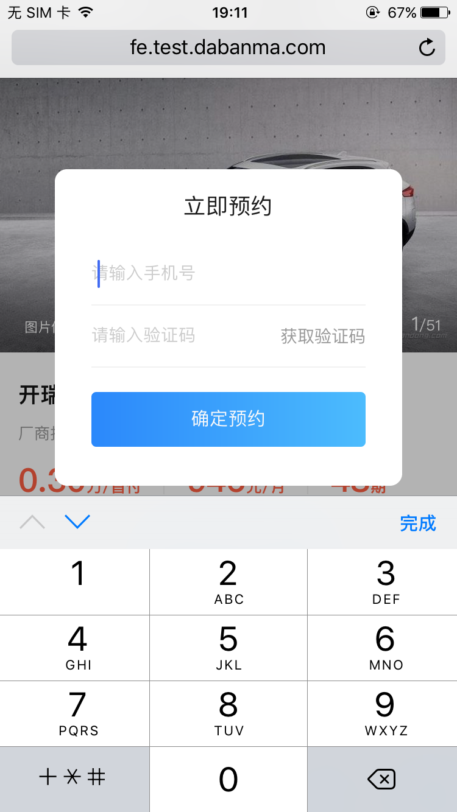

# 移动端适配问题总结
> 本文使用的是zepto语法

>每个标题后面括号里面的是各自的userAgent标识

## 一.常见问题
#### 1.页面上出现蒙层后，蒙层后的页面仍可滑动
> 解决方法一：禁止touchmove事件
```apple js
// 阻止滑动
function defaultEvent(e) {
    e.preventDefault();
}
document.addEventListener("touchmove", defaultEvent, false);

// 如果蒙层消失，页面要恢复滑动：
document.removeEventListener("touchmove", defaultEvent, false);
```

> 解决方法二：给body一个fixed定位
```apple js
// 蒙层出现后，给body添加css样式，但是top要计算一下。
.stop-move {
        position: fixed;
        top:0;
        left: 0;
        width: 7.5rem;
}

 let bodySCTop = $('body').scrollTop();
 $('.stop-move').css('top', '-' + bodySCTop + 'px');

// 蒙层消失后，要去掉样式
    $('body').removeClass('stop-move')
    $('body').scrollTop(bodySCTop);
```

#### 2.


#### 3.
#### 4.
#### 5.
#### 6.
#### 7.


## 二.QQ浏览器

## 三.UC浏览器（UCBrowser）
#### 1.[点击输入框唤起软键盘后，需要点击量词按钮才能触发事件，点击参考百度浏览器类似问题](#twice)
#### 2.使用懒加载时，图片加载不全（有的图片加载了，有的图片加载不出来）
> 解决方法：让所有图片一次性加载完
```apple js
// u是userAgent
// layzrFun(3000),设置了懒加载一次加载多少张
        if (u.indexOf('UCBrowser')) {
            layzrFun(3000);
        } else {
            layzrFun(10);
        }

```

## 四.百度浏览器（baiduboxapp）
#### 1.点击输入框唤起软键盘后，再点击其他绑定了事件的按钮，只会收齐软键盘(失焦)，不会触发按钮绑定的事件。<a id="twice">需要点击两次按钮才能触发事件<a> 。
> 解决方法：
> 获取到userAgent，判断是否为百度浏览器，使用touchstart（touchend也可以）来模拟点击事件。
```angular2html
// #changeOne是按钮，#imgCodeVal是输入框， baiduboxapp是百度浏览器的UserAgent标识
// 关键步骤： 
// ①设置setTimeOut：为了不让事件触发的太快，否则用户体验不好
// ②使用blur让输入框失焦
// ③执行这个按钮应该做的事情
// ④清除定时器

        let ua = navigator.userAgent;
        if(ua.indexOf('baiduboxapp')>-1){
            $('#changeOne').on('touchstart', function() {
                let times = setTimeout(function () {
                    $('#imgCodeVal').blur(); 
                    i++
                    const url = getImageCode(i)
                    $('#code').attr('src', url)
                    clearTimeout(times)
                }, 300)

            });
```

## 五.360浏览器


## 六.QQ内打开(QQ)
#### 1.不拨打电话
> 解决方法：打电话得用a标签
```apple js
//html:
<a href="javascript:;" class="call-to-ask" data-operation='pic'>咨询客服</a>

//js:
var tel = 'tel:4004208848';
$('.call-to-ask').attr('href', tel);
```


## 七.微信APP内打开


## 八.IOS8系统自带safari
#### 1.样式错乱
> 解决方法：看是不是使用了flex布局，这个系统不支持flex布局，使用margin或者定位或浮动来实现


## 九.IOS10系统Safari
#### 1.inpit框回删字符，删完后光标位置不对

> 解决方法：目前没有找到特别好的解决方法，先用这种方法顶替一下：
```apple js
// #tel就是输入框
            if(!$('#tel').val()){
                $('#tel').val('');
            }
```


## 十.三星自带浏览器
#### 1.低版本三星系统自带浏览器不识别border-radius
> 解决方法：找UI要背景图吧


