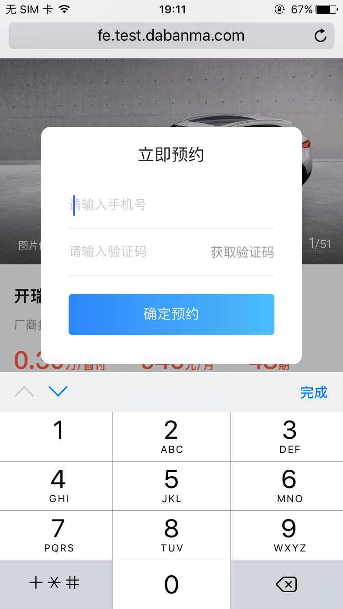

# 移动端适配问题总结
> 本文使用的是zepto语法

>每个标题后面括号里面的是各自的userAgent标识

## 一.常见问题
#### 1.页面上出现蒙层后，蒙层后的页面仍可滑动
> 解决方法一：禁止touchmove事件
```apple js
// 阻止滑动
function defaultEvent(e) {
    e.preventDefault();
}
document.addEventListener("touchmove", defaultEvent, false);

// 如果蒙层消失，页面要恢复滑动：
document.removeEventListener("touchmove", defaultEvent, false);
```

> 解决方法二：给body一个fixed定位
```apple js
// 蒙层出现后，给body添加css样式，但是top要计算一下。
.stop-move {
        position: fixed;
        top:0;
        left: 0;
        width: 7.5rem;
}

 let bodySCTop = $('body').scrollTop();
 $('.stop-move').css('top', '-' + bodySCTop + 'px');

// 蒙层消失后，要去掉样式
    $('body').removeClass('stop-move')
    $('body').scrollTop(bodySCTop);
```


## 二.QQ浏览器

## 三.UC浏览器（UCBrowser）
#### 2.使用懒加载时，图片加载不全（有的图片加载了，有的图片加载不出来）
> 解决方法：让所有图片一次性加载完
```apple js
// u是userAgent
// layzrFun(3000),设置了懒加载一次加载多少张
        if (u.indexOf('UCBrowser')) {
            layzrFun(3000);
        } else {
            layzrFun(10);
        }

```


## 五.360浏览器


## 六.QQ内打开(QQ)


## 七.微信APP内打开


## 八.IOS8系统自带safari
#### 1.样式错乱
> 解决方法：看是不是使用了flex布局，这个系统不支持flex布局，使用margin或者定位或浮动来实现
#### 2.蒙层上有弹框，弹框里面有输入框时候，点击输入框，弹框会自带动画效果似的跳一下。
> 解决方法：前端无法解决，跟产品沟通尽量不要用这种蒙层弹框的交互。


## 九.IOS10系统Safari
#### 1.inpit框回删字符，删完后光标位置不对

> 解决方法：目前没有找到特别好的解决方法，先用这种方法顶替一下：
```apple js
// #tel就是输入框
            if(!$('#tel').val()){
                $('#tel').val('');
            }
```


## 十.三星自带浏览器
#### 1.低版本三星系统自带浏览器不识别border-radius
> 解决方法：找UI要背景图吧
